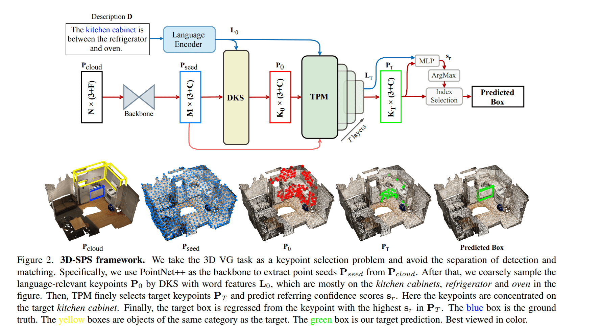

# Daily Logs

## Table of Contents

- [2022](#2022)  
    - [2022/07](#2022/07) 

## 2022
### 2022/07

- **2022/07/01, Vendredi.**

 1. <u>Multi-View Transformer for 3D Visual Grounding(CVPR2022)</u> [[PDF]](https://arxiv.org/pdf/2204.02174.pdf) [[Code]](https://github.com/sega-hsj/MVT-3DVG)
    - Main Idea: Two modals: Point cloud and text. Learn a multi-modal representation independent from from its sepecific single view. Different rotation matrixes are used for robust multi-view representation. Fuse features of each object with the query features.
    - Experiments: Nr3D:55.1%, Sr3D:58.5%, Sr3D+:59.5%(SOTA) ScanRefer:40.80%(GOOD)
    - Reproduce Notes: 
        * 1 RTX 3090 takes almost 15h for Nr3D, 55.1% for Nr3D!
        * Replacing all mentions of AT_CHECK with TORCH_CHECK in ./referit3d/external_tools/pointnet2/_ext_src/src in CUDA 11.
        * Point Cloud Visualization tool: open3d [[Package]](https://github.com/isl-org/Open3D)
        * Point Cloud 3D Box Visualization: [[Code]](/NecessaryCode/MVT-3DVG/Visualize_3D_Bbox.py) 
        * Point Cloud aligned: [[Code]](/NecessaryCode/MVT-3DVG/Visualize_align_PC.py)

    
  

2. <u>Distilling Audio-Visual Knowledge by Compositional Contrastive Learning(CVPR2021)</u> [[PDF]](https://yanbeic.github.io/Doc/CVPR21-ChenY.pdf) [[Code]](https://github.com/yanbeic/CCL)
    - Main Idea: Contrastive Compositional learning for video feature extraction in order to solve sematic gap between two different modalities.
    - Experiments: UCF51:70.0%, ActivityNet:47.3%
    - Reproduce Notes: 
        * 1 RTX 3090 takes almost 10h for UCF101, 3 days for ActivityNet, 6 days for VGGSound.

    
  

- **2022/07/02, Samedi.**
3. <u>3D-SPS: Single-Stage 3D Visual Grounding via Referred Point Progressive Selection(CVPR2022)</u> [[PDF]](https://arxiv.org/pdf/2204.06272.pdf) [[Code]](https://github.com/fjhzhixi/3D-SPS)
    - Main Idea: First single stage 3D visual grounding method. It regards 3DVG task as a keypoint selection problem. Pcloud is inpupt, Pseed is feature, P0 is language-relevant keypooint, Pt is target keypoints and finally, Pt regresses to the bounding boxes.
    - Experiments: ScanRefer:47-48%(SOTA), Nr3D:51.5%, Sr3D:62.6%(GOOD)
    - Reproduce Notes: 
        * 1 Telsa V100 or 2 RTX3090 is enough. It takes almost 39h while training on 2 RTX3090 without multi-view features. 
        * Distributed training yaml [[Code]](/NecessaryCode/3DSPS/default_Distributed.yaml)
        * Distributed training script [[Code]](/NecessaryCode/3DSPS/Distributed_Training.py)
        * In pytorch 1.7.0 environment, you should replace "tile" in lib/ap_helper.py with "repeat".

    
  

- **2022/07/03, Dimanche.**
4. <u>ScanQA: 3D Question Answering for Spatial Scene Understanding(CVPR2022)</u> [[PDF]](https://arxiv.org/pdf/2112.10482.pdf) [[Code]](https://github.com/ATR-DBI/ScanQA)
    - Main Idea: This paper provides a new task: 3D VQA and a baseline which consists of 3 parts: queation and point clouds feature extraction, feature fusion and 3 MLP heads for object classification, answer classification and object localization.
    - Experiments: 23.45%(Baseline)
    - Reproduce Notes: 
        * Not implemented yet.(TODO)
        * 1 Telsa V100 takes < 1 day.

    
  

- **2022/07/04, Lundi.**
5. <u>ScanQA: Text-guided graph neural networks for referring 3d instance segmentation.(AAAI2021)</u> [[PDF]](https://www.aaai.org/AAAI21Papers/AAAI-4433.HuangP.pdf) [[Code]](https://github.com/hanhung/TGNN)
    - Main Idea: This paper dividing the task into two part: 3D instance segmentation and instance refering. 3D mask prediction is interesting. They propose a clustering algorithm to cluster points belonging to the same instance. A text-guided graph neural network is proposed for the second phrase. 
    - Experiments: (Baseline)
    - Reproduce Notes: 
        * Not implemented yet.(TODO)
    
  

- **2022/07/05, Mardi.**
6. <u>X-Trans2Cap: Cross-Modal Knowledge Transfer using Transformer for 3D Dense Captioning(CVPR2022)</u> [[PDF]](https://arxiv.org/pdf/2203.00843.pdf) [[Code]](https://github.com/CurryYuan/X-Trans2Cap)
    - Main Idea: In training stage, they utilize both 2D and 3D modalities as teacher network to teach the student network who only use 3D modality. In inference stage, they only use 3D modality.
    - Experiments: 
    - Reproduce Notes: 
        * Not implemented yet.(TODO)
