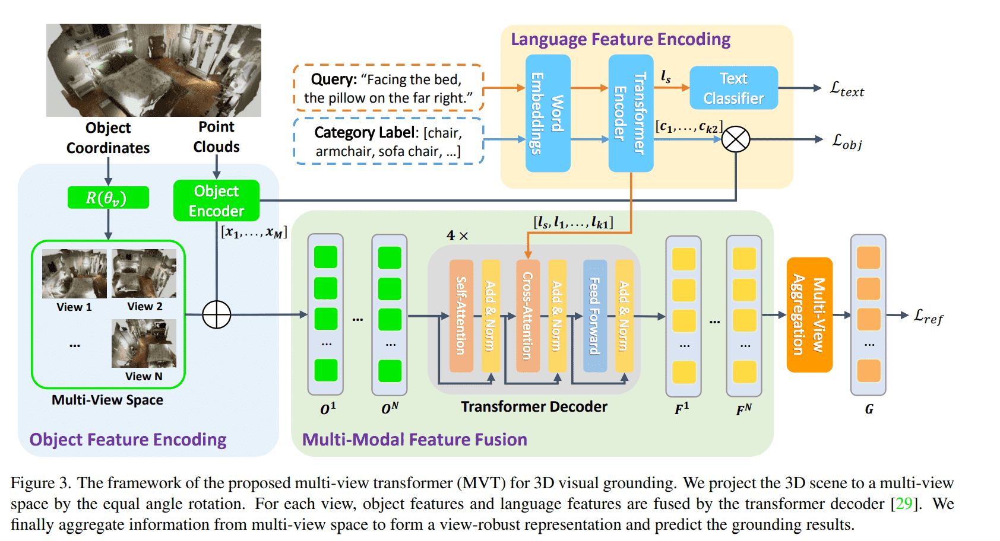
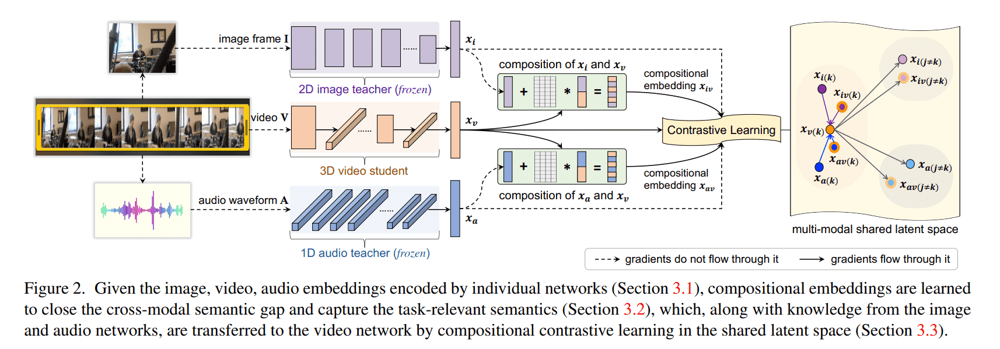
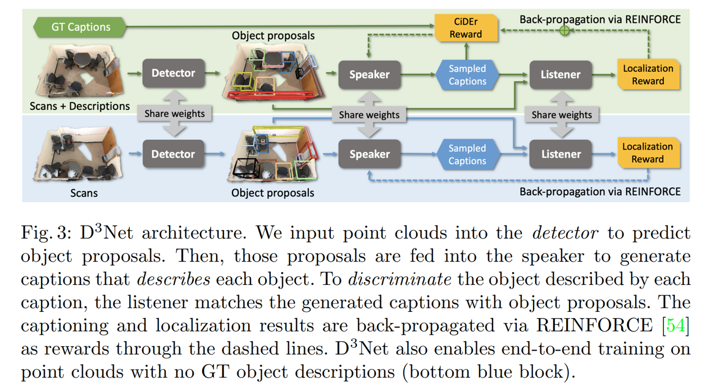

# Daily Logs

## Table of Contents

- [2022](#2022)  
    - [2022/07](#2022/07) 

## 2022
### 2022/07

- **2022/07/01, Vendredi.**
 
 1. <u>Multi-View Transformer for 3D Visual Grounding(CVPR2022)</u> [[PDF]](https://arxiv.org/pdf/2204.02174.pdf) [[Code]](https://github.com/sega-hsj/MVT-3DVG)
    - Main Idea: Two models: Point cloud and text. Learn a multi-modal representation independent from from its sepecific single view. Different rotation matrixes are used for robust multi-view representation. Fuse features of each object with the query features.
    - Experiments: Nr3D: 55.1%, Sr3D: 58.5%, Sr3D+: 59.5%(SOTA) ScanRefer: 40.80%(GOOD)
    - Reproduce Notes: 
        * 1 RTX 3090 takes almost 15h for Nr3D, 55.1% for Nr3D!
        * Replacing all mentions of AT_CHECK with TORCH_CHECK in ./referit3d/external_tools/pointnet2/_ext_src/src in CUDA 11.
        * Point Cloud Visualization tool: open3d [[Package]](https://github.com/isl-org/Open3D)
        * Point Cloud 3D Box Visualization: [[Code]](/NecessaryCode/MVT-3DVG/Visualize_3D_Bbox.py) 
        * Point Cloud aligned: [[Code]](/NecessaryCode/MVT-3DVG/Visualize_align_PC.py)

    <p align="center">  </p>

2. <u>Distilling Audio-Visual Knowledge by Compositional Contrastive Learning(CVPR2021)</u> [[PDF]](https://yanbeic.github.io/Doc/CVPR21-ChenY.pdf) [[Code]](https://github.com/yanbeic/CCL)
    - Main Idea: Contrastive Compositional learning for video feature extraction in order to solve sematic gap between two different modalities.
    - Experiments: UCF51: 70.0%, ActivityNet: 47.3%
    - Reproduce Notes: 
        * 1 RTX 3090 takes almost 10h for UCF101, 3 days for ActivityNet, 6 days for VGGSound.

    <p align="center">  </p>

- **2022/07/02, Samedi.**
3. <u>3D-SPS: Single-Stage 3D Visual Grounding via Referred Point Progressive Selection(CVPR2022)</u> [[PDF]](https://arxiv.org/pdf/2204.06272.pdf) [[Code]](https://github.com/fjhzhixi/3D-SPS)
    - Main Idea: First single stage 3D visual grounding method. It regards 3DVG task as a keypoint selection problem. Pcloud is input, Pseed is feature, P0 is language-relevant keypooint, Pt is target keypoints and finally, Pt regresses to the bounding boxes.
    - Experiments: ScanRefer:47-48%(SOTA), Nr3D:51.5%, Sr3D:62.6%(GOOD)
    - Reproduce Notes: 
        * 1 Telsa V100 or 2 RTX3090 is enough. It takes almost 39h while training on 2 RTX3090 with/without multi-view features. 
        * Distributed training yaml [[Code]](/NecessaryCode/3DSPS/default_Distributed.yaml)
        * Distributed training script [[Code]](/NecessaryCode/3DSPS/Distributed_Training.py)
        * In pytorch 1.7.0 environment, you should replace "tile" in lib/ap_helper.py with "repeat".
        * If you use distributed training, you should add "if args.local_rank == 0" before you save the model.
        * If you use distributed training, you should change the torch.load code in scipts/eval.py to 
        ```python
        checkpoint = torch.load(path)
        model.load_state_dict({k[7:]: v for k, v in checkpoint.items()}, strict=True)
        ```
        * If you want to visualize the results, you should do following steps:
        1) add following code to config/default.yaml 
        ```yaml
        VISUALIZE:
            scene_id: "scene0011_00"
        ```
        2) change some codes in script/visualize.py [[Code]](/NecessaryCode/3DSPS/visualize.py)
        3) run command in the terminal
        ```bash
        python scripts/visualize.py --folder 2022-07-23_20-36_REPRODUCE-MULTIVIEW_DOUBLE_WORKERS-1 --config ./config/default.yaml
        ```
    <p align="center">  </p>

- **2022/07/03, Dimanche.**
4. <u>ScanQA: 3D Question Answering for Spatial Scene Understanding(CVPR2022)</u> [[PDF]](https://arxiv.org/pdf/2112.10482.pdf) [[Code]](https://github.com/ATR-DBI/ScanQA)
    - Main Idea: This paper provides a new task: 3D VQA and a baseline which consists of 3 parts: question and point clouds feature extraction, feature fusion and 3 MLP heads for object classification, answer classification and object localization.
    - Experiments: 23.45% (Baseline)
    - Reproduce Notes: 
        * Not implemented yet. (TODO)
        * 1 Telsa V100 takes < 1 day.

    <p align="center">  </p>

- **2022/07/04, Lundi.**
5. <u>ScanQA: Text-guided graph neural networks for referring 3d instance segmentation.(AAAI2021)</u> [[PDF]](https://www.aaai.org/AAAI21Papers/AAAI-4433.HuangP.pdf) [[Code]](https://github.com/hanhung/TGNN)
    - Main Idea: This paper dividing the task into two part: 3D instance segmentation and instance refering. 3D mask prediction is interesting. They propose a clustering algorithm to cluster points belonging to the same instance. A text-guided graph neural network is proposed for the second phrase. 
    - Experiments: (Baseline)
    <p align="center">  </p>

- **2022/07/05, Mardi.**
6. <u>X-Trans2Cap: Cross-Modal Knowledge Transfer using Transformer for 3D Dense Captioning(CVPR2022)</u> [[PDF]](https://arxiv.org/pdf/2203.00843.pdf) [[Code]](https://github.com/CurryYuan/X-Trans2Cap)
    - Main Idea: In training stage, they utilize both 2D and 3D modalities as teacher network to teach the student network who only use 3D modality. In inference stage, they only use 3D modality.
        * They propose a different fusion module: randomly mask the teacher features and add it to the student feature.
        * They propose a different object representation method.   
    - Experiments: 

- **2022/07/06, Mercredi.**
7. <u>3DJCG: A Unified Framework for Joint Dense Captioning and Visual Grounding on 3D Point Clouds(CVPR2022)</u> [[PDF]](https://openaccess.thecvf.com/content/CVPR2022/papers/Cai_3DJCG_A_Unified_Framework_for_Joint_Dense_Captioning_and_Visual_CVPR_2022_paper.pdf) [[Code]](https://github.com/zlccccc/3DJCG)
    - Main Idea: This paper provides a unified framework for joint dense captioning and visual grounding on 3D point clouds. Feature representation and fusion modules are task-agnostic which are designed for collaboatively learning.
    - Experiments: SOTA on ScanRefer and Nr3D, even better than 3D Vision Gounding paper in IJCV2022.
    - Reproduce Notes: 
      * 1 RTX3090 takes almost 4 days to train and 1h*"repeats" to validate on ScanRefer dataset.
      * If you use multi-view features, this project will occupy **212GB** of space. So, you'd better rent GPUs in BeiJing district in AutoDL.
      * Scan2CAD dataset and its preprocessing are also needed to train this project. [[Code]](https://github.com/daveredrum/Scan2Cap)
      * If your system is CUDA11.0+, you should replace pointnet++ in the original repo with 3DSPS.
      * To issue:"No module named 'quaternion", you should type "pip install numpy-quaternion" in the terminal.
      * ScanRefer dataset can directly unzip in the dataset folder.
      * "ScanRefer_filtered_organized.json" can be obtained by [[Code]](https://github.com/heng-hw/SpaCap3D/blob/16fcfb20f68f0b605b007aa554e12566175ef646/scripts/organize_scanrefer.py)
      * Training arguments must match validation arguments or you will get a RunTime Error: size mismatch.
      * Java is a must.
      ```bash
      sudo apt-get update
      sudo apt-get install openjdk-8-jdk
      ```
      * "--num_ground=150" means avoiding the training of the caption head for the first 150 epochs.

Visual Grounding：

|  Validation Set  |             |          |  Unique  |  Unique | Multiple | Multiple |  Overall | Overall |
|:----------------:|:-----------:|:--------:|:--------:|:-------:|:--------:|:--------:|:--------:|:-------:|
|      Methods     | Publication | Modality | Acc@0.25 | Acc@0.5 | Acc@0.25 |  Acc@0.5 | Acc@0.25 | Acc@0.5 |
|       3DJCG (Paper)      |   CVPR2022  |    3D    |   78.75  |  61.30  |   40.13  |   30.08  |   47.62  |  36.14  |
|       3DJCG (Paper)      |   CVPR2022  |  2D + 3D |   83.47  |  64.34  |   41.39  |   30.82  |   49.56  |  37.33  |
|       3DJCG (Our Reproduce)      |   CVPR2022  |  2D + 3D |   81.98 |  63.18  |   41.35  |   30.04  |   49.23  |  36.47  |
    - Future work: Performance of vision grounding will improve.  

- **2022/07/07, Jeudi.**
- I try to do an experiment on COCO2017 dataset with 4 RTX3090s!

8. <u> Escaping the Big Data Paradigm with Compact Transformers(Arxiv202206)</u> [[PDF]](https://arxiv.org/pdf/2104.05704.pdf) [[Code]](https://github.com/rishikksh20/compact-convolution-transformer)
    - Main Idea: This paper design a new transformer architecture for training on small dataset. First, they reduce the layers, heads and hidden dimensions. Then, they design SeqPool module:x'=softmax(g(f(x)).T) => z=x'*x, where f is transformer encoder, g is a linear layer. Finally, a convolutional tokenizer, which substitutes for patch and embedding is designed to introduce an inductive bias into the model. 
    - Experiments: SOTA in small dataset such as Cifar10 and Flower102.  
    <p align="center">  </p>

- **2022/07/08, Vendredi.**
- After adding Transformer to IEEC, although the training process is unstable, it can surpass the baseline! Here is the validation accuracy reported by tensorboard:
<p align="center">  </p>

9. ReferIt3D: Neural Listeners for Fine-Grained 3D
Object Identification in Real-World Scenes<u> (ECCV2020)</u> [[PDF]](https://www.ecva.net/papers/eccv_2020/papers_ECCV/papers/123460409.pdf) [[Code]](https://github.com/referit3d/referit3d)
    - Main Idea: They introduce a two-part dataset: a high quality synthetic dataset of 83572 referential utterances (Sr3D) and a dataset with 41503 natural (human) referential utterances (Nr3D). 

- **2022/07/09, Samedi.**
Run the 3DJCG code.

- **2022/07/10, Dimanche.**
10. PointNet: Deep Learning on Point Sets for 3D Classification and Segmentation<u> (CVPR2017)</u> [[PDF]](https://openaccess.thecvf.com/content_cvpr_2017/papers/Qi_PointNet_Deep_Learning_CVPR_2017_paper.pdf) [[Code]](https://github.com/charlesq34/pointnet)
    - Main Idea: This paper fully exploits permutation invariant property of points cloud and propose PointNet. This paper also provides some theoretical analysis in [[Supplemental]](https://openaccess.thecvf.com/content_cvpr_2017/supplemental/Qi_PointNet_Deep_Learning_2017_CVPR_supplemental.pdf).

- **2022/07/11, Lundi.**
- Experiment on COCO2017 dataset with 4 RTX3090s is over. The experiment lasted for 5 days! My results surpass the baseline model.

- **2022/07/20, Mercredi.**
11. Spatiality-guided Transformer for 3D Dense Captioning on Point Clouds<u> (IJCV2022)</u> [[PDF]](https://arxiv.org/pdf/2204.10688.pdf) [[Code]](https://github.com/heng-hw/SpaCap3D)
    - Main Idea: This paper proposed SpaCap to do 3D Dense Captioning. Main-axis spatial relation label maps are prepocessed before training. They can be used as the prior knowledge for model. Besides, this paper also propose a new Transformer decoder: vision token mask and word token mask are both fed to self-attention layer.
    - Reproduce Notes: 
        * Successful
<p align="center">  </p>

- **2022/07/30, Samedi.**
12. D3Net: A Unified Speaker-Listener Architecture for 3D Dense Captioning and Visual Grounding<u> (ECCV2022)</u> [[PDF]](https://daveredrum.github.io/D3Net/D3Net.pdf) [[Code]](https://github.com/daveredrum/D3Net)
    - Main Idea: This paper proposed D3Net to do 3D visual grounding and dense captioning jointly. This self-critical property of D3Net also introduces discriminability during object caption generation and enables semi-supervised training on ScanNet data with partially annotated descriptions. They outperforms SOTA methods in both tasks on the ScanRefer dataset.
    - Reproduce Notes: 
        * Not provide a yaml file.
<p align="center">  </p>

When the downloaded zip file is corrupted, we can fix it by WinRAR!

### 2022/09
- **2022/09/05, Lundi.**
1. 基于深度学习的图像复原技术研究_武士想 (2022中科大博)
<p align="center">  </p>
非盲图像复原：包括超分和去噪（超分*2+去噪*1）
盲图像复原：（基于无监督CycleGAN框架*1）
盲图像单张图像复原：（基于生成模型*1）
 